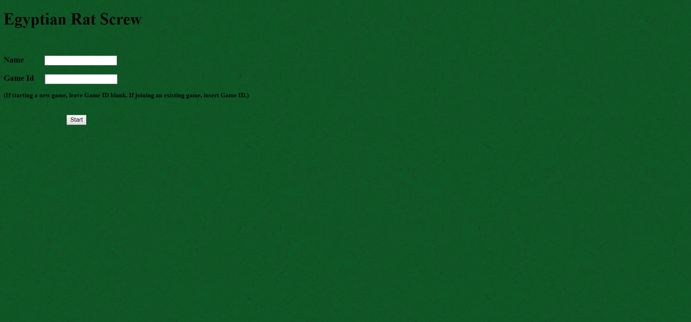

# Egyptian Rat Screw
This project is a single-page web app based on the card game Egyptian Rat Screw.

The game begins with a screen that allows a player to enter their name and choose to join a game or start a new game. If starting a game, the game ID is given to the user and the user waits for someone to join. If joining a game, a player must enter the game ID of an existing game. Once the players join, the game screen begins and displays the opponent's name and deck at the top of the screen. The discard pile is in the middle of the screen and the player's deck and name are at the bottom. The player's turn is displayed as text in the top left of the screen and the slap button is enabled. Play alternates, according to [the game rules](https://bicyclecards.com/how-to-play/egyptian-rat-screw/), until the winner collects all the cards in the deck. For the slap rule, only the 'double rule' is used. The winner of each round is displayed and when the game terminates, the game winner is displayed.

The project is a single-page app which uses AJAX. The game logic is written in PHP and runs on a server. Each new game is stored in a MySQL database as a PHP serialized object. The object is converted to a json when read and sent to the client. Javascript is used on the front-end to extract game data and display the game. HTML, CSS, and JQuery are also used on the front-end. The server can support multiple games concurrently.

### Login Screen

### New Game

### Join

### Start

### Win Round

### Win Game

